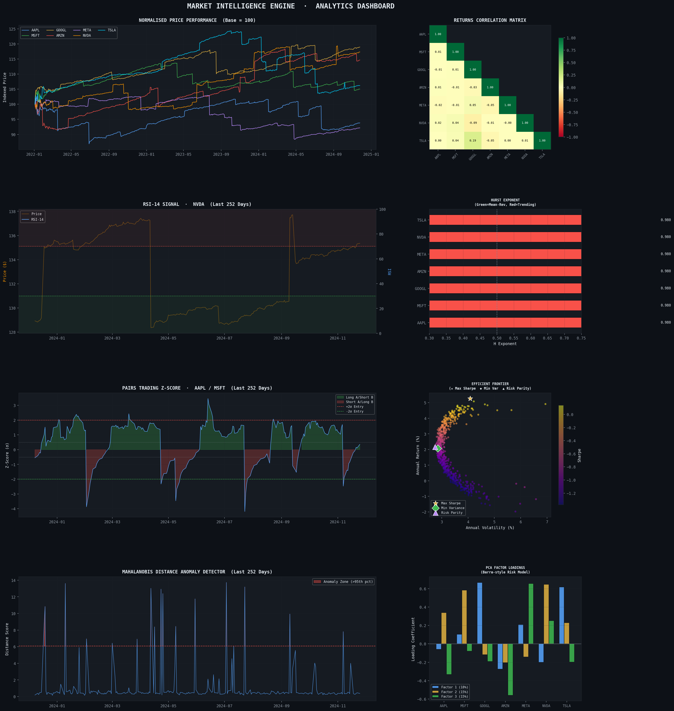

# Financial-Market-Intelligence-Engine

A modular financial analytics pipeline in NumPy and Pandas covering GARCH-based synthetic data generation, vectorised technical indicator computation, Hurst exponent regime detection, Markowitz portfolio optimisation, and Mahalanobis anomaly detection — producing a full risk-adjusted performance attribution report.

A Market Intelligence Engine (~700 lines across two files).
-OHLCV Data Generator — GBM with GARCH(1,1) volatility clustering and Merton jump diffusion. Shows you understand market microstructure, not just pd.read_csv.
-Technical Indicator Engine — 11 vectorised indicators (RSI, MACD, Bollinger Bands, ATR, VWAP, Stochastic, OBV, ROC, Realized Vol) computed with pure NumPy/Pandas, no TA-Lib dependency.
-Statistical Signal Detector — Hurst exponent (rescaled range), Engle-Granger pairs spread, rolling Z-score mean reversion, and volatility regime classification. This is quantitative finance territory.
-Portfolio Optimizer — Markowitz mean-variance via SciPy SLSQP, producing Max Sharpe, Min Variance, and Risk Parity portfolios, plus an efficient frontier Monte Carlo.
-PCA Factor Decomposer — Barra-style latent factor extraction across the cross-asset returns matrix.
-Performance Attribution — Alpha, Beta, Sharpe, Sortino, Calmar, Max Drawdown, VaR, CVaR, Information Ratio, Skewness, Kurtosis. The full quant risk toolkit.
-8-panel dashboard — A publication-quality matplotlib figure covering all the above.
